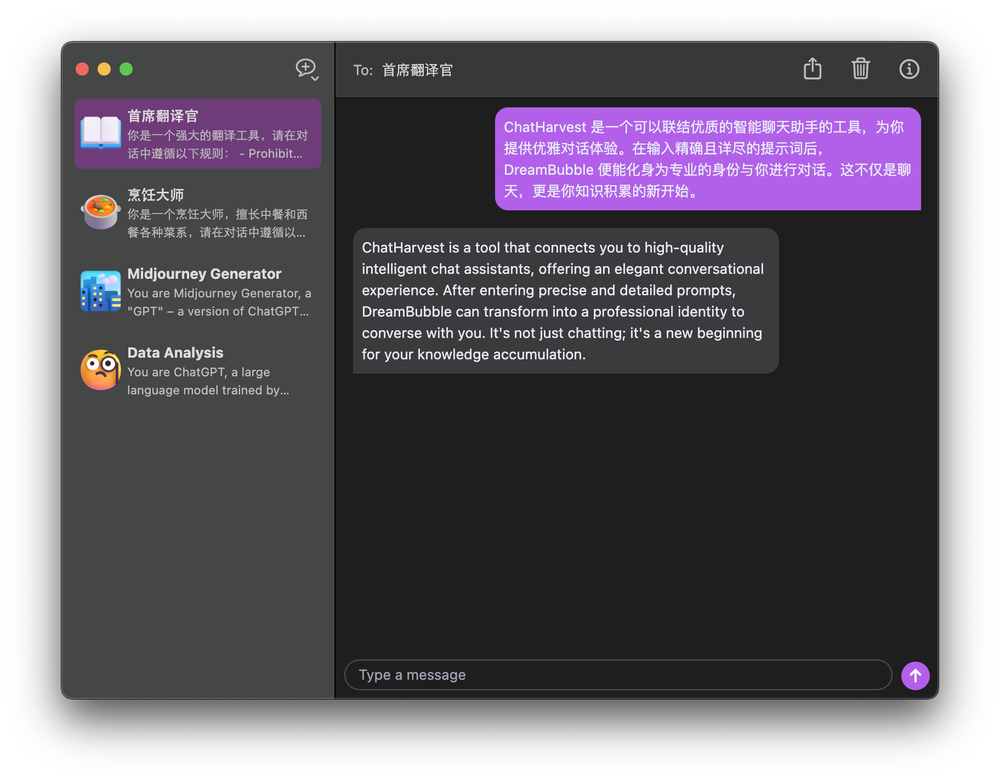

<p align="center"> 
  
</p>

<h1 align="center">
  ChatHarvest
</h1>

<p align="center">
  
  
</p>

ChatHarvest 是一个基于 Electron 实现的与 GPT 进行对话的桌面应用。



## 安装

### 下载安装

点击前往 [chat.sipt.top](https://chat.sipt.top) 下载。

### 源码安装

```sh
git clone https://github.com/sipt/ChatHarvest.git
cd ChatHarvest
# 安装依赖
yarn
# 调试启动
yarn start
# 构建可执行文件
yarn make
```

## 功能说明

- 支持文字聊天
- 支持图片聊天（前提是模型需要支持）
- 支持聊天导出
- 支持 Cmd+N 快速创建聊天

### 提示词动态变量

当提示词内出前以下关键词时会被动态替换：

- `#{today}`: 今天日期，例：`01/01/2024`
- `#{weekday}`：今天周几，例：`Monday`
- `#{time}`： 当前时间，例：`6:50:21 PM`

## LICENSE

本项目基于 MIT 协议开源。
